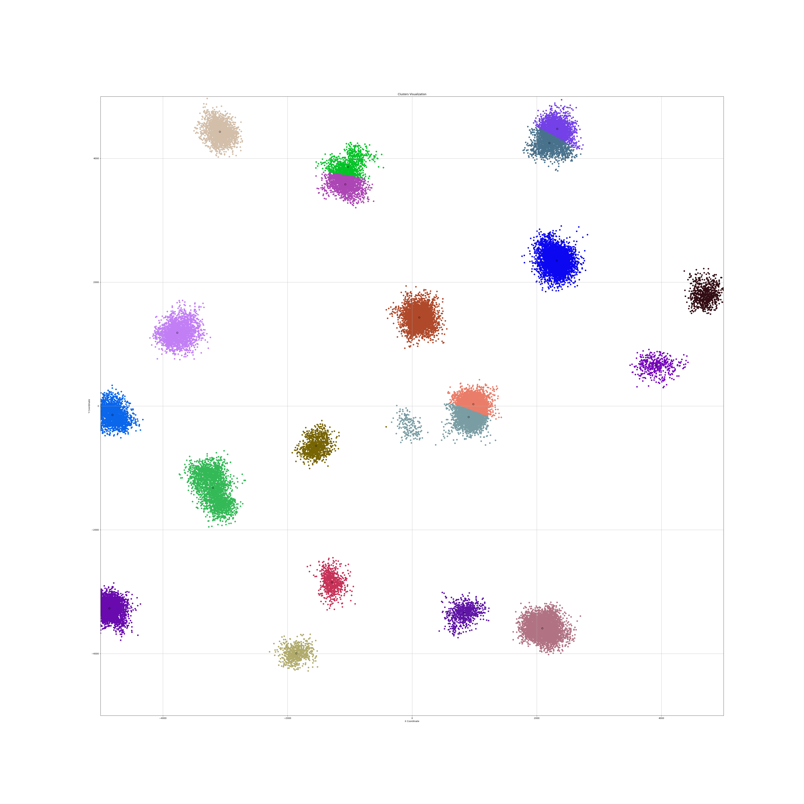
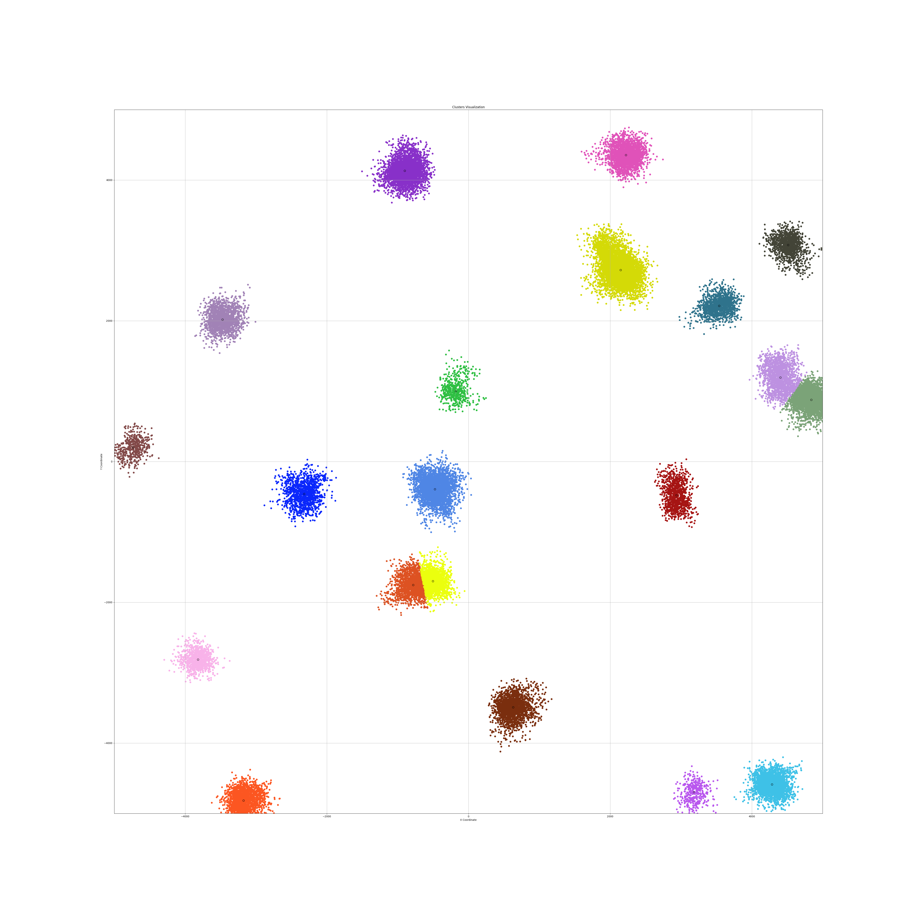
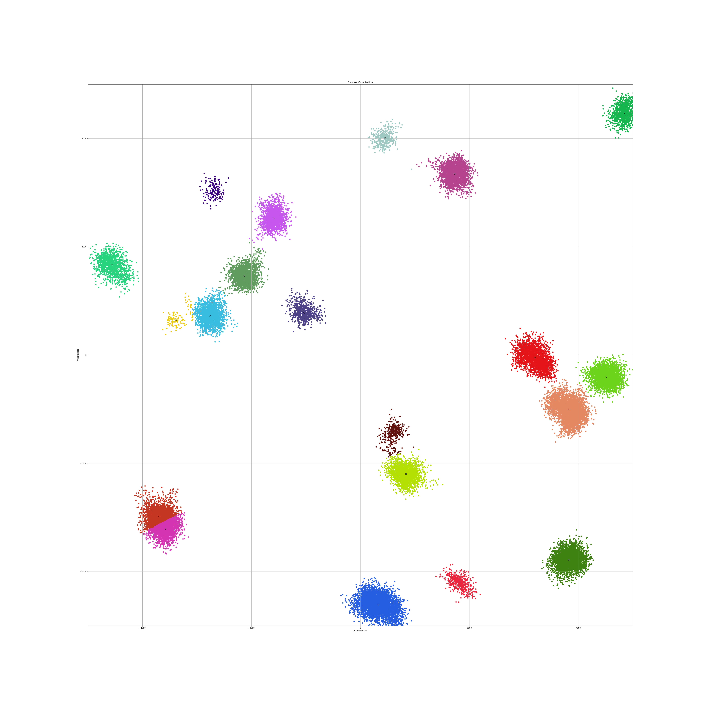
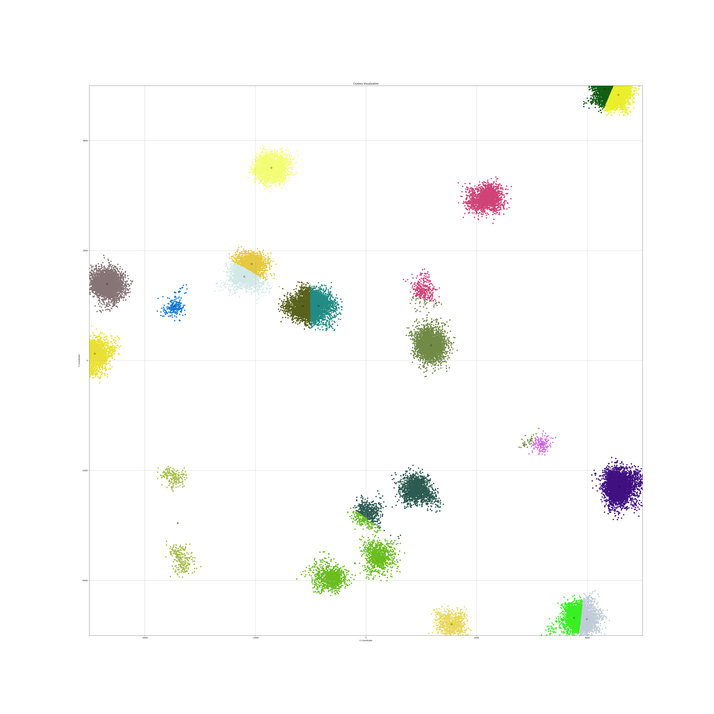
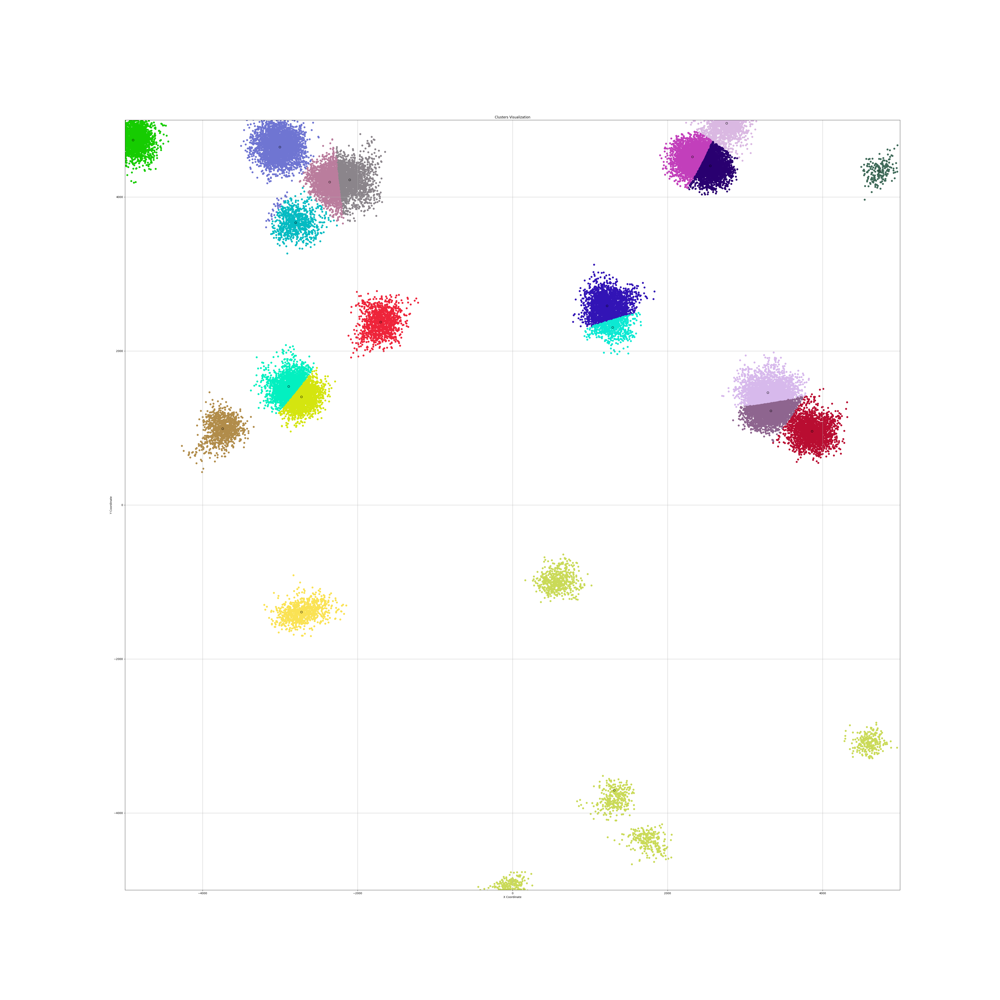
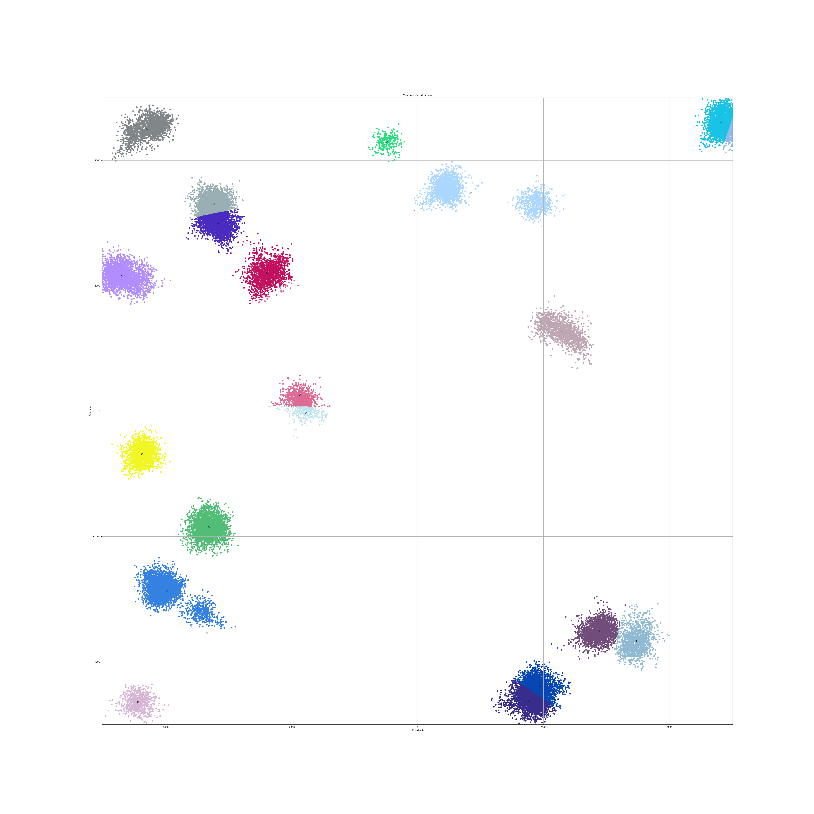

# Assigment 2 (K-means clustering)
The task is to implement the K-means clustering algorithm.
The main goals are:
1. Generate 20 points in 2D plane 10 000 x 10 000 
2. Generate 40 000 points near already created
3. No points should be in the same place
4. Implement 3 types of K-means clustering algorithm

## Structure of project

All common methods are implemented in `common.py` file (such as generating points)
Plotting methods are implemented in `plotting.py` file
All constants are stored in `constants.py` file
`main.py` file is used to run the program (here you can choose which algorithm to run)

## Task 1 - By centroid
Implement the K-means clustering algorithm by centroid.

### Solution
The algorithm is implemented in file `centroid.py`

Steps:
- Initialize cluster:
  - For each point in the points array, the minimum distance to any of the existing centroids is calculated.
  - The point with the maximum of these minimum distances is selected as the next centroid. This ensures that new centroids are as far away as possible from the existing centroids.

- Assign points to clusters:
  - For each point in the points array, the minimum distance to any of the existing centroids is calculated.
  - The point is assigned to the cluster of the centroid with the minimum distance.

- Update centroids:
  - For each cluster, the new centroid is calculated as the mean of all points in the cluster.

- Repeat the previous two steps until the centroids do not change.

## Task 2 - By metoid
Implement the K-means clustering algorithm by metoid.

### Solution
The algorithm is implemented in file `metoid.py`

Steps:
- Initialize cluster:
  - Cluster initialization is the same as in the previous algorithm.

- Assign points to clusters:
  - same as in the previous algorithm.

- Update centroids:
  - For each cluster, the new centroid is calculated as the point in the cluster with the smallest sum of distances to all other points in the cluster.

- Repeat the previous two steps until the centroids do not change.

## Task 3 - By divisive clustering

Implement the K-means clustering algorithm by divisive clustering.

Steps:
- Initialize cluster:
  - Using centroid clustering algorithm, initialize the two clusters.

- Recursively divide the clusters:
  - Apply the centroid clustering algorithm to each of the two clusters.
  - Repeat the previous step until the desired number of clusters is reached.

### Verification
- The correctness of the algorithms is verified by plotting the points and the clusters. The points are colored according to the cluster they belong to.
- After running the algorithms, for each cluster is calculated distance between each point and centroid. And is being printed if the distance is greater than 500.

## Results 
The best result I got with the metoid clustering algorithm. 
Centroid clustering algorithm was goog as well.
Divisive clustering algorithm was the worst.
